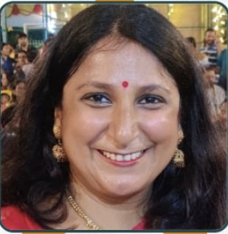

# How to Add Real Team Photos

## 📸 Photo Replacement Instructions

Based on your campaign materials, here are the steps to replace placeholder photos with actual team photos:

### Step 1: Save Team Photos
1. Extract/crop photos from your campaign materials
2. Save each photo with the member's name (e.g., `krishna-tripathi.jpg`)
3. Recommended size: 200x250 pixels (portrait orientation)
4. Formats: JPG, PNG, or WEBP

### Step 2: Upload Photos
Option A: Place photos in a `photos` folder:
```
manhattan-campaign/
├── photos/
│   ├── krishna-tripathi.jpg
│   ├── amol-arsad.jpg
│   ├── bhoyar-aniket.jpg
│   ├── sangeeta-guha.jpg
│   ├── sudeshna-ghosh.jpg
│   ├── pratima-chormale.jpg
│   └── ... (other team members)
├── index.html
├── styles.css
└── script.js
```

### Step 3: Update HTML
Replace placeholder URLs in `index.html`:

#### Featured Leaders Section:
```html
<!-- Krishna Tripathi -->


<!-- Amol Arsad -->


<!-- Bhoyar Aniket -->

```

#### Women Leaders Section:
```html
<!-- Sangeeta Guha -->


<!-- Sudeshna Ghosh -->


<!-- Pratima Chormale -->

```

### All Team Members Photo Replacement:

1. **Sagar Thakare**: `photos/sagar-thakare.jpg`
2. **Suraj Gadekar**: `photos/suraj-gadekar.jpg`
3. **Anand Shinde**: `photos/anand-shinde.jpg`
4. **Suchit Ovhal**: `photos/suchit-ovhal.jpg`
5. **Darshan Borse**: `photos/darshan-borse.jpg`
6. **Abhishek Kumar**: `photos/abhishek-kumar.jpg`
7. **Himanshu Odak**: `photos/himanshu-odak.jpg`
8. **Abhinav Whatte**: `photos/abhinav-whatte.jpg`
9. **Ashutosh Kotkar**: `photos/ashutosh-kotkar.jpg`
10. **Sujit Vhanawade**: `photos/sujit-vhanawade.jpg`
11. **Akshay Kamble**: `photos/akshay-kamble.jpg`
12. **Anand Bhagwat**: `photos/anand-bhagwat.jpg`
13. **Shailesh Surwade**: `photos/shailesh-surwade.jpg`

### Step 4: Quick Find & Replace
You can use find and replace in your text editor:

**Find**: `https://via.placeholder.com/200x250/[COLOR]/FFFFFF?text=[NAME]`
**Replace**: `photos/[member-name].jpg`

For example:
- Find: `https://via.placeholder.com/200x250/ff6b35/FFFFFF?text=Krishna+Tripathi`
- Replace: `photos/krishna-tripathi.jpg`

### Alternative: Online Photo URLs
If you prefer to host photos online:
1. Upload photos to Google Drive, Dropbox, or image hosting service
2. Get public/direct link to each photo
3. Replace placeholder URLs with actual photo URLs

### Photo Tips:
- Keep photos professional and high-quality
- Ensure good lighting and clear faces
- Maintain consistent style/background if possible
- Optimize file size for web (under 500KB per photo)

### Need Help?
If you need assistance with photo extraction or editing, you can:
1. Use photo editing software to crop photos from campaign materials
2. Ask a designer to help extract individual photos
3. Use online tools for batch photo processing
